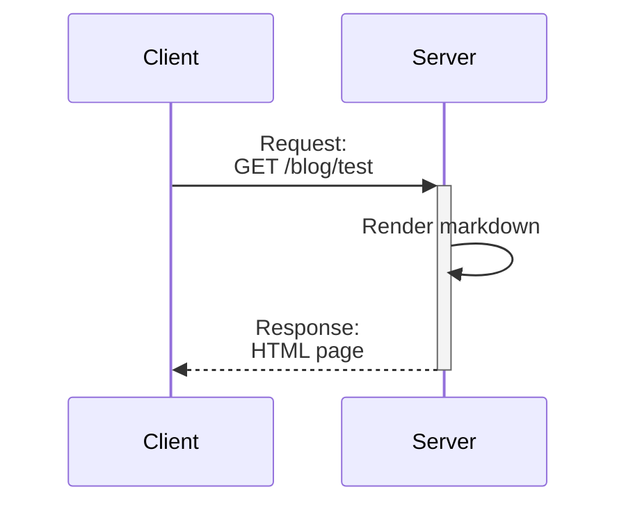
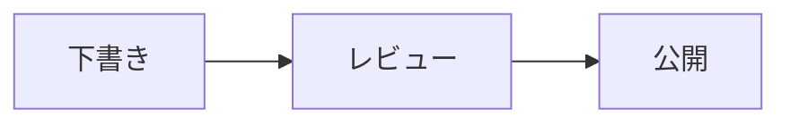

このページは GFM (GitHub Flavored Markdown) の各種記法を片っ端から試すレンダリングテスト用の記事です。

# 見出し 1（基本使わない）

## 見出し 2

### 見出し 3

#### 見出し 4

##### 見出し 5

###### 見出し 6

## 段落と改行 (Paragraphs / Line breaks)

これは段落です。文章が続きます。文章が続きます。文章が続きます。

行末にバックスラッシュを置くと\
強制改行になります。

行末にスペース 2 つでも
強制改行になります。

## 強調 (Emphasis)

- _イタリック_ / _イタリック_
- **太字** / **太字**
- **_太字イタリック_**
- ~~打ち消し線~~ (GFM strikethrough)
- `インラインコード`
- **太字の中に `コード` を含む**

## リンク (Links)

- [インラインリンク](https://example.com)
- [タイトル付きリンク](https://example.com "ツールチップのタイトル")
- 自動リンク (GFM autolink): https://example.com
- メールの自動リンク: contact@example.com
- [参照リンク][ref1]
- [相対パスのリンク](/wiki)

[ref1]: https://example.com/reference "参照スタイルのリンク"

## 画像 (Images)


[](https://example.com)

## 引用 (Blockquotes)

> これは引用です。
> 複数行にまたがることもできます。

> 外側の引用
>
> > ネストされた引用
> >
> > > さらにネスト

> 引用の中に **太字** や `コード` 、[リンク](https://example.com) も書けます。
>
> - 引用の中のリスト
> - 二つ目の項目

## リスト (Lists)

### 順序なしリスト

- 項目 1
- 項目 2
  - ネストした項目 2-1
  - ネストした項目 2-2
    - さらにネスト 2-2-1
- 項目 3

### 順序付きリスト

1. 最初の項目
2. 二番目の項目
   1. ネストした項目
   2. ネストした項目
3. 三番目の項目

### 混在リスト

1. 順序付きの中に
   - 順序なしをネスト
   - もう一つ
2. 戻ってくる

### タスクリスト (GFM task list)

- [x] 完了したタスク
- [ ] 未完了のタスク
- [ ] ネストもできる
  - [x] サブタスク（完了）
  - [ ] サブタスク（未完了）

### 複数段落を含むリスト

1. 最初の項目。

   同じ項目内の二つ目の段落。インデントを揃えます。

2. 二番目の項目。

   ```txt
   リスト内のコードブロック
   ```

## テーブル (GFM tables)

| 左寄せ                     |   中央寄せ   |       右寄せ |
| :------------------------- | :----------: | -----------: |
| セル                       |     セル     |          100 |
| 長めのテキストが入ったセル |    `code`    |        2,500 |
| **太字**                   | _イタリック_ | ~~打ち消し~~ |

| 記法                             | 対応 |
| -------------------------------- | ---- |
| パイプのエスケープ \| こんな感じ | OK   |
| 空セル                           |      |

## コード (Code)

### インラインコード

`const x = 42;` のように文中に埋め込めます。バッククォートを含む場合は `` `backtick` `` と書きます。

### コードブロック（言語指定あり）

```js
// JavaScript
function greet(name) {
  console.log(`Hello, ${name}!`);
}
greet("world");
```

```python
# Python
def fib(n: int) -> int:
    return n if n < 2 else fib(n - 1) + fib(n - 2)

print([fib(i) for i in range(10)])
```

```rust
// Rust
fn main() {
    let nums: Vec<i32> = (1..=5).collect();
    let sum: i32 = nums.iter().sum();
    println!("sum = {sum}");
}
```

```cpp
// C++
#define PI 3.141592653589793238462643383279502884197169399375105820974944592307816406286208998628034825342117067982148086513282306647093844609550582231725359408128481117450284102701938521105559644622948954
```

```css
/* CSS */
.page {
  padding: 2.5rem 0 clamp(3rem, 8vw, 6rem);
}
```

```json
{
  "name": "test",
  "version": "1.0.0",
  "private": true
}
```

```sh
echo "hello" | tr 'a-z' 'A-Z'
```

```bash
#! /bin/bash

for f in *.md; do
  echo "processing $f"
done
```

```go
// ----- main.go -----
package main

import "fmt"

func main() {
	fmt.Println(Add(1, 2))
}

// ----- add.go -----
package integer

// Add adds two integers and returns the result.
func Add(a, b int) int {
	return a + b
}

// ----- add_test.go -----
package integer_test

import "testing"

func TestAdd(t *testing.T) {
	type testCase struct {
		name string
		a, b int
		want int
	}

	testCases := []testCase{
		{name: "negative + negative", a: -1, b: -2, want: -3},
		{name: "negative + zero", a: 0, b: -1, want: -1},
		{name: "negative + positive = negative", a: -1, b: 2, want: 1},
		{name: "zero + zero", a: 0, b: 0, want: 0},
		{name: "zero + positive = positive", a: 0, b: 1, want: 1},
		{name: "positive + negative = negative", a: 1, b: -2, want: -1},
		{name: "positive + positive = positive", a: 2, b: 1, want: 3},
		{name: "positive + zero = positive", a: 1, b: 0, want: 1},
		{name: "positive + positive", a: 1, b: 2, want: 3},
	}

	for _, tc := range testCases {
		t.Run(tc.name, func(t *testing.T) {
			t.Parallel()
			if got := Add(tc.a, tc.b); got != tc.want {
				t.Errorf("Add(%d, %d) = %d; want %d", tc.a, tc.b, got, tc.want)
			}
		})
	}
}
```

```yml
# YAML
name: chasing-the-kernel
on:
  push:
    branches: [main]
```

```toml
# TOML
[package]
name = "chasing-the-kernel"
version = "0.1.0"
```

```diff
- 削除された行
+ 追加された行
  変更なしの行
```

```txt
プレーンテキスト。
```

```hogehoge
存在しない言語 hogehoge を指定。
指定しているが表示されない。
```

```
言語指定なしのプレーンテキスト。
存在しない言語を指定しているときと同じように言語ラベルは表示されない。
```

### コードブロック内のコードフェンス

````md
```js
console.log("フェンスの中にフェンス");
```
````

## 水平線 (Horizontal rules)

---

---

---

## 脚注 (Footnotes)

これは脚注付きの文章です[^1]。複数の脚注も使えます[^note]。

[^1]: これが脚注の内容です。

[^note]: 名前付きの脚注。**装飾**や[リンク](https://example.com)も書けます。

## エスケープ (Escaping)

\*アスタリスク\* や \_アンダースコア\_ 、\# シャープ、\[角括弧\] をエスケープすると記号のまま表示されます。

## HTML の直接記述

<details>
<summary>クリックして展開 (details / summary)</summary>

折りたたまれた中身です。Markdown も書けます。

- リスト項目
- `コード`

</details>

<kbd>Cmd</kbd> + <kbd>Shift</kbd> + <kbd>P</kbd> のようなキーボード表記。

上付き: X<sup>2</sup> / 下付き: H<sub>2</sub>O

$\LaTeX$ の数式: $x^2 + y^2 = z^2$

<mark>ハイライトされたテキスト</mark>

## GitHub アラート (GFM alerts)

> [!NOTE]
> 補足情報を伝えるノートです。

> [!TIP]
> 便利なヒントです。

> [!IMPORTANT]
> 重要な情報です。

> [!WARNING]
> 注意が必要な警告です。

> [!CAUTION]
> 危険を伝える注意書きです。

## Mermaid ダイアグラム





## 絵文字 (Emoji shortcodes)

GFM のショートコード記法: :smile: :rocket: :+1: :tada:

Unicode 絵文字の直書き: 😄 🚀 👍 🎉

## その他

- 温度は 25&deg;C です（HTML エンティティ）
- 著作権記号: &copy; 2026
- ダッシュ: -- と ---（smartypants が有効なら en/em ダッシュになる）
- "引用符" と 'シングルクォート'
